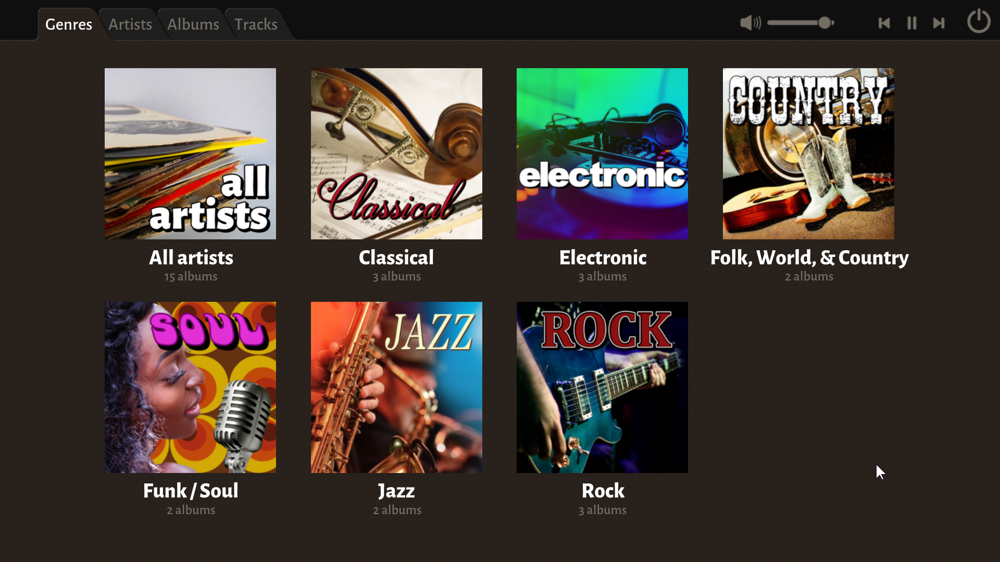
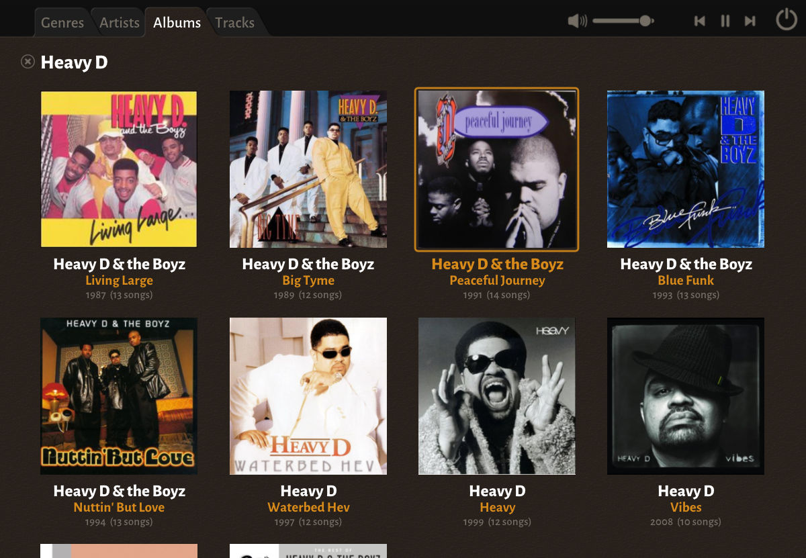

# I &#9825; Music

I &#9825; Music is an MP3 player and organizer. It is designed for handling collections of albums in MP3 format, 
and it is very visual, attempting to capture some aspects of the physical feel of an album collection. I &#9825; Music
doesn't handle loose MP3's very well, and it doesn't do queueing of songs, or playlists and things like that. Think of 
it like a digital record collection. It excels at browsing and listening to albums, and it is designed to be fast and
responsive even with large collections of albums.



I built the application because I couldn't find one which worked the way I wanted it to. I also wanted one which is
easy to maintain and update to keep working year after year, so it is written in Ansi C, with as few dependencies as 
possible (and none of them external to the source code). The source code is being made available for free use 
(public domain), so even if I would stop supporting it at some point in the future, it would be possible for others 
to fix any future issues that would arise.



## Download

To download a pre-built binary, bundled with some MP3s so you can try it out before populating it with your own tracks,
please visit the project home at https://mattiasgustavsson.itch.io/i-love-music

## Building

To build the project, simply run the following command from a Visual Studio Developer Command Prompt

```
    cl source\i_love_music.c
```

Alternatively, to build with optimizations enabled and with an embedded application icon, run the batch file `build.bat`
from a Developer Command Prompt.

The project is currently Windows only, but there are actually quite few Windows specific parts, so a port should not
be too hard, should anyone want to attempt it.
