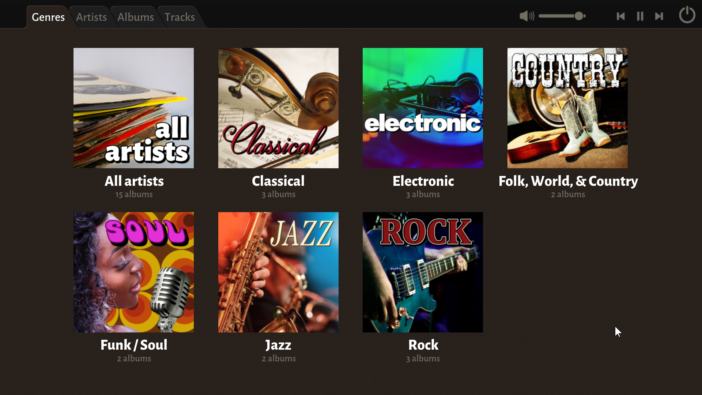

# Mattias Gustavsson's

# MP3 Player/Organizer

# User Guide

---

Introduction
------------

I &#9825; Music is an MP3 player and organizer. It is designed for handling collections of albums in MP3 format, 
and it is very visual, attempting to capture some aspects of the physical feel of an album collection. I &#9825; Music
doesn't handle loose MP3's very well, and it doesn't do queueing of songs, or playlists and things like that. Think of 
it like a digital record collection. It excels at browsing and listening to albums, and it is designed to be fast and
responsive even with large collections of albums.

I built the application because I couldn't find one which worked the way I wanted it to. I also wanted one which is
easy to maintain and update to keep working year after year, so it is written in Ansi C (the most widely supported 
programming language), with as few dependencies as possible (and none of them external to the source code). The source
code is being made available for free use (public domain), so even if I would stop supporting it at some point in the
future, it would be possible for others to fix any future issues that would arise.

Installing and Running
----------------------

Installing I &#9825; Music is very straightforward - just unzip the file anywhere and double-click the application.

This is a *portable application*, meaning it doesn't use an installer, and it can be freely moved around or even 
put on a USB stick or moved to a different computer. All temporary data and settings are stored in this same location,
so it can be moved around as necessary.

First time you run the program, it will take a bit of time to prepare some internal data for faster access. This will
only be done once, and it will display this splash screen while it is working.

The next time you launch the application, it should start pretty much instantly - at most within a second or two.

Overview
--------

The first view you see when launching the application looks like this - it is listing musical genres and shows how
many albums there are in the collection for each one.

I &#9825; Music comes with 15 albums included (made possible by Free Music Archive and the generous artists making their
work available there), so that you can start using and getting a feel for the program without having to set it up to access
your own album collection. The idea is of course for you to replace these with your own music, and we will go through how
to do that later in this document. There are some genre thumbnails which comes with the application, but these can be
replaced with your own, and thumbnails for additional genres are easily added, as we will see later.

At the very top of the window there are four tabs: *Genres*, *Artists*, *Albums* and *Tracks*. 

These can be used to select the current view, but you can also use function keys `F1` to `F4` to select, or `TAB` to cycle 
to the next tab (and `Shift` + `TAB` to go to the previous one). Selecting one of the thumbnails in a view (like the genre
thumbnails for example) will also change the current view. You can always get back to this starting view with the genre
listing by pressing `F1` or clicking on the *Genres* tab which is always in the top left of every view.

In the top right part of the window, you can see these controls:

You can use the slider to adjust the volume (the volume of I &#9825; Music - it does not affect the global systems volume)
or mute the sound (by clicking the speaker icon). The play controls to the right of the slider can be used to change to the
next or previous tracks (but only if an album is currently selected for play), and to play/pause the currently playing
track. Alternatively, you can also use the `LEFT` and `RIGHT` cursor keys and the `SPACE` key for the same functionality.
The on/off icon at the very right, can be used to minimize the application to the system tray (the `ESC` key will do the
same thing). Of course, if you have a keyboard with *media keys*, or headphones with play control buttons, those can also
be used to select next or previous tracks or to play/pause the current track.

At some point, you might see an arrow icon next to the volume slider:

This icon only appears when an album is playing, but you have navigated away from it. Pressing this arrow will take you to
the *Tracks* view displaying the currently playing album.

### Genres

Now, let's look at the main view, listing the genres:

If there are more genres than fits in the window, you can use cursor keys `UP` and `DOWN` to scroll, or the scroll wheel on
your mouse. To scroll an entire page at a time, you can use `PAGE UP` and `PAGE DOWN` keys. `HOME` will take you to the top
and `END` will go to the bottom.

### Artists

Hovering over a thumbnail and clicking with the left mouse button will switch to the *Artists* view, showing only the albums
belonging to the selected genre. 

As an example, if we select the *Classical* genre, which has three albums, we will get the *Artists* view like this:

The *Artists* view is similar to the *Genres* view, but showing album thumbnails instead of genre thumbnails. Scrolling 
works the same in all views. Each thumbnail in this view represents an artist, and is composed of a stack of album covers.
The pictures are retrieved from tags in the MP3 files, and if there are no images in the MP3 tag data, a generic default
image is used. 

One difference from the *Genres* view is that along the bottom is a line of characters like this:

These can be used to quickly scroll to a specific place in the list of artists. It might not make much sense when having 
only a few artists in a view, but with hundreds of artists it can be very useful. Artists are always sorted in alphabetical
order (ignoring `The` at the start) with artists whose name starts with a number being placed at the very top. Clicking the
corresponding letter (or the `#` sign for those starting with a number) will scroll to the location of the first artists
whose name start with that letter. Clicking the question mark `?` on the far right will scroll to a random location, which
can be a nice way to help making a random choice of what to listen to. Using the corresponding keys on the keyboard will
perform the same function.

Just above the thumbnails, there is a text label informing us which genre we are currently viewing:

To the left of the genre text is a *Close* symbol. When this is clicked, we will still be in the *Artists* view, but with
no filter applied - it will show all the artists in your collection, regardless of which genre they belong to. The same
can be achieved by selecting the *All artists* thumbnail from the *Genres* view:

### Albums

Just as clicking on a thumbnail on the *Genres* view brought us to the *Artists* view, showing us artists filtered by the
chosen genre, clicking a thumbnail on the *Artists* view will switch to the *Albums* view, filtered by the chosen artist.
As an example, clicking on the thumbnail for *Brendan Kinsella* will switch to this view:

The *Albums* view shows all albums from the chosen subsection, which can be either an artist, as in this case, a genre, or
all albums in the collection. Albums are sorted by year, with the oldest first, and with compilation albums and albums
missing the year tag last.

Note that selecting an artist with only a single album takes us directly to the *Tracks* view, as a filtered 
*Albums* view for that artist would only show one option anyway.

Let's say that instead of selecting *Brendan Kinsella* from the artists screen, we select the thumbnail for *All Classical
albums*. Then we would get this instead:

Here we would see all albums from the *Classical* genre. They are still sorted by artist though, and the letters on the
bottom of the view scrolls to the artist whose name start with that letter. 

Just like in the *Artists* view, there is a title text showing what subset we are currently viewing, next to the *Close*
button which allow us to view all albums instead of the current selection:

In the *Albums* view, we don't see stacks of albums as we did in the *Artists* view, but rather an individual thumbnail for
each album. Underneath the image (which again is taken from the MP3 tag data, if available) we can see the name of the
artist, the name of the album, the year it was released and the number of songs it contains.

### Tracks

Clicking on a thumbnail in the *Albums* view will go to the *Tracks* view, displaying all the tracks for the selected album
along with play controls:

On the left hand side, beneath the cover art, are these playback controls:

We have the standard controls for previous/next track, play/pause and stop, and for fast-forward and rewind (for those last
two you have to hold down the mouse button rather than just clicking them once). Play/pause can also be done by clicking on
the image of the album cover, or by pressing `SPACE` on the keyboard. For previous/next track, you can use the `LEFT` and
`RIGHT` cursor keys.

On the right, are three icons for *Loop* (repeat the currently playing song over and over), *Shuffle* (play the tracks of an
album in random order) and *Repeat* (play all the tracks of the album over and over). These are toggle buttons, and you turn
them on and off by clicking on them. When they are displayed in an orange color, they are in their on-state. The settings 
are global, and not specific to the current album - if you have enabled shuffle and then play a different album, shuffle
will still be enabled for the new album.

A the bottom is a timeline slider. When a track is playing, it will show how far along in the track the playback is, and it
allows you to jump to any position in the track by clicking and draggin the handle on the slider. To the left of the slider
it displays how many minutes and seconds of the track have been played, and on the right of the slider it displays how much
of the track is left to play (the total length of the track is displayed in the track list).

On the right side of the view, there is a list of all the tracks and information about the selected album:

At the top is the name of the artist - this can be clicked, and will then go to the *Albums* view filtered on that artist.
Just below is the name of the album, and the year (if available).

The currently playing track will be highlighted in orange, and you can switch to any track by clicking it. If the track list
has more entries than fit on the screen, you can use cursor keys `UP` and `DOWN`, as well as `PAGE UP`, `PAGE DOWN`, `HOME`
and `END` keys to scroll the view, just like in the other views. Alternatively, you can use the scroll wheel on the mouse to
scroll, but be aware that using the mouse wheel when over the album cover image will zoom in on the image instead of 
scrolling the view.

For each track, the track number and length is displayed. Track numbers are taken from the MP3 tag information, and might 
not always be linearly incrementing from 1, although that is the typical case.

In some cases, an album might consist of more than one disc. In this case, the discs are displayed as icons underneath the
album title:

It allows you to select all discs, or a single one from the set.

Some MP3 files may contain multiple pictures, and not just the album cover image. If this is the case, thumbnails of the
additional pictures will be displayed underneath the play controls, like this:

Clicking on a thumbnail will select that picture to be displayed above the play controls.

Using the scroll wheel on your mouse while hovering over the large cover image, you can zoom in so the image covers the
entire screen:

Use the mouse wheel again to zoom back out. While in the zoomed in mode, cursor keys `LEFT` and `RIGHT` flips through all
the pictures for the album (if it has multiple ones).

### System Tray

While the application is running, a heart icon is displayed in the system tray:

Windows may be hiding it by default, but you can change that in Windows Taskbar settings. Left-clicking the icon will bring
I &#9825; Music to the foreground (whether it is minimized or just behind other windows).

When hovering over the systray icon, a tooltip will show the currently playing artist and track name:

Right-clicking the systray icon will bring up this menu:

It allows you to toggle between window and fullscreen mode, and you can also use function key `F11` or `Alt`+`ENTER` to do
the same. The *Open* option brings the application to the foreground, same as clicking the icon. The `Quit` option exits
the application.

---

Adding Your Own MP3s
--------------------

The easiest way to replace the bundled music with your own, is to simply delete the contents of the `music` folder in the 
`i_love_music` folder, and copy your own MP3 files there instead. 

How you structure your files doesn't matter, I &#9825; Music finds all MP3 files in the `i_love_music` folder, and it
doesn't care about folder structure.

I &#9825; Music does not write to the MP3 files, but it is still recommended that you place a copy of your files in the
`i_love_music` folder rather than placing your only copy there - there are no guarantees that nothing will ever go wrong.

It is also possible to point out one directory in a different location to scan for MP3 files. This is useful if you, for
example, have a large music collection that you store on a slower, but larger, drive (or even on a network drive) but you
still want the application on your faster SSD drive (which is recommended for performance reasons). To do this, you have
to create a file called `settings.ini` and add a `music_path` setting to it. The next section describes what you can do
with the settings. When using an external location, MP3 files in the `i_love_music` folder are still included as well.

Settings
--------

There are currently only a handful of settings you can change in I &#9825; Music, and there is no way to change them within
the application. This will change in a future version of the application, when there will be more options for customization
and a proper settings screen added. For the time being though, the way to change the setting is to create a plain text file
named `settings.ini` and place it next to the `i_love_music.exe` file in the `i_love_music` folder. 

The values you can add to the `settings.ini` file are `music_path`, `scale`, `touch_input`, `ffwd_speed` and `rewind_speed`:

`music_path` is explained in the section `Adding Your Own MP3s`. It is used to point to an additional location to scan for 
MP3 files. It should be the full path including the device. The trailing backslash `\` is not required.

`scale` is useful if you want the contents of the application to be displayed smaller or larger than default. Values higher
than one will make the contents larger, values lower than one will make it smaller.

`touch_input` might be useful if you are running the app on a touch screen. I &#9825; Music does not have full support for 
touch input yet, but the built-in Windows functionality producing clicks when you tap the touch screen will let you do most
things, except scrolling (technically you could scroll by pinching, as this emulates the scroll wheel, but it feels quite 
bad). To make scrolling a bit more practical, setting `touch_input` to `true` will allow you to click-and-drag on the views
to scroll them - either with your finger on a touch screen or with the mouse. 

`ffwd_speed` and `rewind_speed` can be used to control how fast the fast forward and rewind functionality will be. The
default is 6 times normal play speed, but you might want this to be faster or slower.

You don't have to add all the values to the `settings.ini` file, just the ones you want to modify. The default values are: `scale=1.0`, `touch_input=false`, `ffwd_speed=6`, `rewind_speed=6`.

MP3 Tags
--------

MP3 files contains embedded information about the song - things like artist, album, year, genre, album cover image etc. 
When albums are listed in I &#9825; Music, everything is based off of these embedded tags, so the usefulness of the player
will directly depend on the quality of your MP3 tags. Most good online stores for buying digital music should have decent
information embedded in their tracks. When converting an audio CD to MP3 files, make sure you use software which can 
download song information from an online database. Personally, I use Exact Audio Copy (www.exactaudiocopy.de) which works
very well and can also verify that the transfer was correct. Information from online databases seems to be mostly good
these days, but it is not always perfect. If you find that an album is not listed in the way you expect, try looking at the
tags using an MP3 tag editor. There are many available, the one I use is Mp3tag (www.mp3tag.de/en).

### Genres

The biggest problem with automatically acquired MP3 tags is the *Genre* field. There's simply no standard for what different
genres are used, and it seems like every person contributing tag information to databases make up their own genres, 
sub-genres and sub-sub-genres. I &#9825; Music doesn't care what genres you have - it doesn't have any built-in list of 
"correct" genres, it will just display any genres it finds in the tag information for all songs. Personally, I prefer to
have broad genres with many albums in each, rather than a finely grained subdivision, so I decided I would arrange my music
collection accordning to the genres defined by Discogs (www.discogs.com), a site that provides information on music releases
of all kinds. 

---

Discogs defines only 15 genres in total, and uses the concept of *Style* for dividing it further into sub-genres. 

* Blues
* Brass & Military
* Children's
* Classical
* Electronic
* Folk, World, & Country
* Funk / Soul
* Hip-Hop
* Jazz
* Latin
* Non-Music
* Pop
* Reggae
* Rock
* Stage & Screen

I felt that the genres it defines are good enough for my needs. It also means that I &#9825; Music only comes with
pre-made genre thumbnails for those 15 genres. There is nothing stopping you from having more genres or entirely other
genres, but those will all have the default genre thumbnail unless you make your own.

As my chosen set of genres does not always match the automatically acquired tag information, I wanted a way to remap
existing genres into my chosen set, without having to individually edit the MP3 tags of each file. For this, there is a
file called `genre_remap.ini`

If you open this file in a text editor like Notepad, you will see that it looks something like this:

It is just a list of genres and what they should be remapped to. On the left side of the `=` is the genre name as it is
found in the MP3 files tag information, on the right side of the `=` is the genre you want it to be known as in I &#9825; 
Music. The `genre_remap.ini` that comes with the program is the one I use for my files, where I have tried to remap all
the odd genres from my own MP3 collection into the 15 genres that I have made genre thumbnails for. You can edit this file
to change the mapping to your liking, add more lines for additional mappings, or delete the file entirely if you don't
want the program to do any remapping at all.

---

Custom Genre Thumbnails
-----------------------

The thumbnails used for genres are all stored in the `genres` folder:

The way it works is really simple; for every genre, the program tries to load a PNG image file with the same name as
the genre from the `genres` folder:

The name of the image file is simplified though. All spaces and special character are left out and only the characters
`a`-`z` are left. So if we wanted to add another genre thumbnail, let's say we want one for the genre *Game Soundtracks*,
we would create a PNG image and save it with the name `gamesoundtracks.png`. And a genre with a name like *Folk, World, & 
Country* would simply become `folkworldcountry.png`.

Various Artists
---------------

One feature which deserves a special mention, is the handling of albums that contain songs by multiple artists. Those are
treated as special case *Various Artists* albums, and are shown like this:

Rather than the usual stack of albums as you would get for an artist, you get the custom *Various Artists* thumbnail.
Clicking on it will give you an album view like this:

At the top it clearly states that this is the listing of albums by various artists, and which genre it is for.

In the tracks view for an album with multiple artists, the artist names are displayed next to each track, like this:

Albums will be considered to belong to Various Artists if the `Artist` or `Album Artist` tags for the files is literally
"Various Artists", or if the tracks of an album have different values in the Artist tag. In the latter case though, all
Artist values are compared, and if they all start the same way, the longest common run of letters will be used as the 
artist for the album. 

As an example, in this album, all tracks have the value `Ke$ha` for the Artist tag, except tracks 6 and 16 which have the
value `Ke$ha feat. 3OH!3` and `Ke$ha feat. Taio Cruz`, respectively.

Notice how the artist for this album will be recognized as *Ke$ha*, as that is the longest common part from all tracks, and
that track 6 and 16 have the remaining parts added below the track name.

Only common parts of at least 4 letters will be considered, to reduce the risk of interpreting things wrong - a minimum 
length of 4 seems to give enough of a unique string to avoid confusion. It is however always possible to override all this
by putting the artist name you want in the `Album Artist` MP3 tag.

Override Artist Grouping
------------------------

Sometimes, it is useful to be able to override how albums are grouped. The normal grouping is based on artist name, but 
sometimes an artist change their name over time, but you might still want to group them together as one artist, while still
displaying the appropriate names for the different albums.

One example of this can be seen here, where all the albums by *Heavy D* are grouped together under the artist name 
*Heavy D*, both the ones released as solo albums, and the ones released under the group name *Heavy D & the Boyz*:

To achieve this, we simply need to set the *Sort Album Artist* MP3 tag to *Heavy D*, while leaving the *Album Artist* and/or
*Artist* fields as their original values. This will override just the grouping (and the name displayed for the grouping) but
not the artist name for the individual albums.

Cache
-----

In order to be fast and responsive, and to start up instantly, I &#9825; Music creates a cache of all the information that
it has extracted from the MP3 files, both tag data and images. Even though I have done a lot of work to make sure that the
cache remains correct at all time, even when you add, remove or modify the tags of your MP3 files, there is a lot of 
complexity in this system, and there might be times when things go wrong. If you find that some albums don't show up as they
should, or show up multiple times or similar, the best thing to do is close the application, delete the cache, and run it
again, and most likely any issues will be gone.

The cache is in a folder called `.cache`:

Deleting it is as simple as just deleting the whole .cache folder - it will be recreated next time you run the program.

---

Credits
-------

I &#9825; Music was designed and programmed by Mattias Gustavsson.

### Third-party Libraries

Some free, open source libraries by other people are used:

* miniaudio - https://github.com/mackron/miniaudio
* glad - https://github.com/Dav1dde/glad
* minimp3 - https://github.com/lieff/minimp3
* wyhash - https://github.com/wangyi-fudan/wyhash
* stb_image.h / stb_image_resize.h / stb_truetype.h - https://github.com/nothings/stb

### Thanks To

For testing, feedback and ideas:

* Tanja Gustavsson
* Jonatan Hedborg
* Matthieu Chardon
* Ted Martens

### Licensing

The I &#9825; Music application is public domain (or CC0 if you prefer). License text here:
https://creativecommons.org/publicdomain/zero/1.0/

I make no warranties about the product, and I take no responsibility for how it is used, or accept any liability for 
damages that may occur while using it. I made it, that's all I wanted to do.

The font used in the application and documentation is Alegreya Sans by Juan Pablo del Peral, and it is under the *SIL Open
Font License* 
https://www.fontsquirrel.com/license/alegreya-sans

Genre thumbnails are based on stock photos from pixabay.com, and are under the following license: 
https://pixabay.com/service/license/

---

The bundled music tracks are supplied by Free Music Archive, and the license for the different artists are as follows:

* BJ Block and Dawn Pemberton `CC BY-ND`  
  https://creativecommons.org/licenses/by-nd/3.0/
* Brendan Kinsella `PD`  
  https://creativecommons.org/licenses/publicdomain/
* Color Kings `CC BY-NC-SA 4.0`  
  https://creativecommons.org/licenses/by-nc-sa/4.0/
* Daniel Blanch `PD`  
  https://creativecommons.org/licenses/publicdomain/
* Dazie Mae `CC BY-NC-SA`  
  https://creativecommons.org/licenses/by-nc-sa/3.0/us/
* Handmade Moments `CC BY-NC-SA`  
  https://creativecommons.org/licenses/by-nc-sa/3.0/us/
* Mahogany Marie `CC BY`  
  https://creativecommons.org/licenses/by/4.0/
* Marwood Williams `CC BY-NC-ND`  
  https://creativecommons.org/licenses/by-nc-nd/4.0/
* Rolemusic `CC BY`  
  https://creativecommons.org/licenses/by/4.0/
* Seth Power `CC BY`  
  https://creativecommons.org/licenses/by/4.0/
* Still Pluto `CC BY-NC-SA 4.0`  
  https://creativecommons.org/licenses/by-nc-sa/4.0/
* Antique Phonograph Music `PDCL`  
  https://freemusicarchive.org/Sound_Recording_Common_Law
  
  
  
  
  

